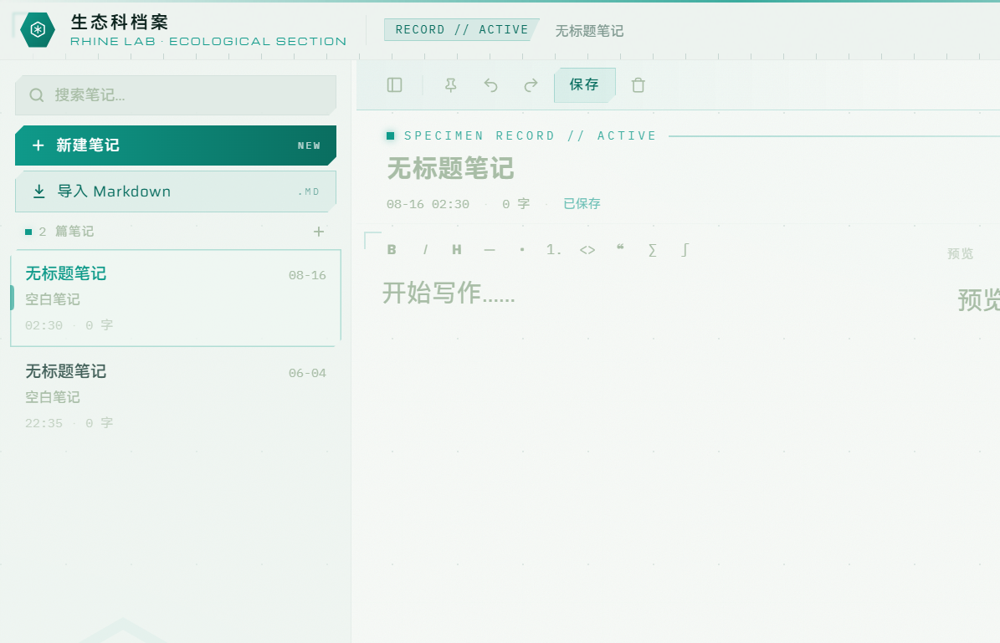

<!-- markdownlint-disable -->

**简体中文** | [English](README_en-US.md)

<div align="center">


# 生态科档案 Ecology Section Archive

莱茵生命生态科风格的本地 Markdown 便签档案终端<br>
基于 Tauri 2 + React 构建 · 支持 ECO 启动器种植

[反馈问题](https://github.com/Muelsyselove/Leaf/issues) · [更新日志](https://github.com/Muelsyselove/Leaf/releases)<br>
[快速开始](#快速开始) · [ECO 接入](#eco-接入) · [从源码构建](#从源码构建)

[](https://github.com/Muelsyselove/Leaf/releases/latest)
[](LICENSE)<br>


</div>

<!-- markdownlint-restore -->

---

## 项目简介

「生态科档案」是一款以《明日方舟》莱茵生命生态科（Rhine Lab · Ecological Section）为视觉主题的本地 Markdown 便签应用。本项目在开源项目 [floral-notepaper](https://github.com/Achilng/floral-notepaper) 的基础上进行了彻底的品牌与界面重制：完整保留原有业务能力，将界面重塑为生态科数据终端风格——浅灰绿底色、生态青强调色、切角多边形、菱形网格、扫描线与六边形徽标，配合 Saira / Michroma / IBM Plex Mono 字体组合，让每一次记录都像在录入一份样本档案。

> 本项目为个人学习性质的风格化二次创作，与鹰角网络（Hypergryph）及《明日方舟》官方无关。



## 功能特点

- **Markdown 编辑与预览** — 支持 GFM 语法、KaTeX 数学公式、GFM Alerts、文章内标题跳转，编辑 / 预览 / 分栏三种视图随时切换
- **快捷便签** — 通过托盘或全局快捷键（默认 `Ctrl+Space`）随时唤出便签窗口，支持跟随鼠标位置出现
- **磁贴模式** — 将笔记固定在桌面任意位置，便于快速查阅和复制
- **图片与文件** — 支持粘贴、拖拽图片到编辑器，直接拖入 `.md` / `.markdown` / `.txt` 文件打开
- **导入导出** — 支持 `.md` 文件的导入与导出
- **顺手的细节** — 自动保存、撤销 / 重做、编辑区右键菜单、Tab 缩进、Toast 通知
- **多语言** — 简体中文 / 繁體中文 / English
- **个性化** — 自定义主窗口背景图片、自定义全局快捷键、开机自启
- **应用内更新** — 在设置中直接检查、下载并安装新版本

## 应用场景

- 当作随时可见的剪贴板，快速暂存和复制文本
- 游戏、看视频时随手记点东西
- 临时记录思路或灵感
- 桌面待办清单

## 快速开始

### 方式一：ECO 启动器种植（推荐）

本仓库是 ECO 友好项目。使用 [ECO 启动器](https://github.com/Muelsyselove/Rhine-Lab-Ecological-Section) 直接「种植」本仓库，即可自动完成下载、解压、依赖装配与启动。

### 方式二：本地运行（开发调试）

环境要求：[Node.js](https://nodejs.org/) 24+ 与 [Rust](https://www.rust-lang.org/) 工具链（Windows 需安装 Visual Studio Build Tools）。

```bash
git clone https://github.com/Muelsyselove/Leaf.git
cd Leaf
npm install
npm run start
```

Windows 下也可以直接双击 `start.bat`（自动处理端口占用与执行策略）。

### 运行测试

```bash
npm test
```

## ECO 接入

仓库根目录内置 [eco-manifest.json](eco-manifest.json)，Release 仅提供 ECO 友好压缩包 `ecology-section-archive-<version>-eco.tar.gz`（完整源码树 + 依赖清单 + 启动清单），不再附带安装器。ECO 据此完成「施肥」（`npm install`）与「观察」（`npm run start`）。

> 由于本应用基于 Tauri，首次启动需在本机编译 Rust 后端，请确保已安装 Rust 工具链。

## 从源码构建

```bash
npm install
npm run tauri build
```

构建产物位于 `src-tauri/target/release/bundle/`。

## 技术栈

| 分层     | 技术                                |
| -------- | ----------------------------------- |
| 桌面框架 | Tauri 2（Rust 2021）                |
| 前端     | React 19 · TypeScript · Vite        |
| 样式     | Tailwind CSS 4                      |
| Markdown | react-markdown · remark-gfm · KaTeX |
| 国际化   | i18next · react-i18next             |
| 测试     | Vitest（96 项测试）                 |

## 项目结构

```text
├── src/                  # 前端（React + TypeScript）
│   ├── components/       # 主窗口、设置、关于、磁贴、生态科装饰组件
│   ├── features/         # markdown / notes / settings / update / windows 等功能域
│   ├── locales/          # 三语翻译资源
│   └── assets/fonts/     # Saira / Michroma / IBM Plex Mono 等字体
├── src-tauri/            # Rust 后端（Tauri 2：笔记存储、窗口管理、更新器）
├── Docs/                 # 文档与界面截图
├── scripts/              # 版本同步、截图等开发脚本
├── start.bat / start.ps1 # Windows 一键启动入口
└── eco-manifest.json     # ECO 启动器接入清单
```

## 界面截图许可

本项目**允许任何人对本程序界面进行截图、录屏**，并用于介绍、评测、分享、二次创作参考等用途，无需事先征得同意。

## 开源协议

本项目基于 [MIT License](LICENSE) 开源：

- 原始项目代码 © [Achilng](https://github.com/Achilng)（floral-notepaper，MIT）
- 品牌重制与新增部分 © [Muelsyselove](https://github.com/Muelsyselove)

第三方组件与字体许可见 [THIRD_PARTY_NOTICES.md](THIRD_PARTY_NOTICES.md) 及 `src/assets/fonts/` 目录下的许可文件。

## 致谢

- [floral-notepaper](https://github.com/Achilng/floral-notepaper) — 本项目的功能基础，感谢 Achilng 及所有上游贡献者
- [Tauri](https://tauri.app/) · [React](https://react.dev/) · [Tailwind CSS](https://tailwindcss.com/) · [Vite](https://vite.dev/) · [i18next](https://www.i18next.com/) · [react-markdown](https://github.com/remarkjs/react-markdown) · [KaTeX](https://katex.org/)
- 字体：[Saira](https://fonts.google.com/specimen/Saira) · [Michroma](https://fonts.google.com/specimen/Michroma) · [IBM Plex Mono](https://www.ibm.com/plex/) · HarmonyOS Sans SC · 思源宋体
- 《明日方舟》莱茵生命 — 视觉风格灵感来源（非官方致敬）

## 相关项目

- [Rhine-Lab-Ecological-Section](https://github.com/Muelsyselove/Rhine-Lab-Ecological-Section) — ECO 启动器，与本项目同一视觉体系
